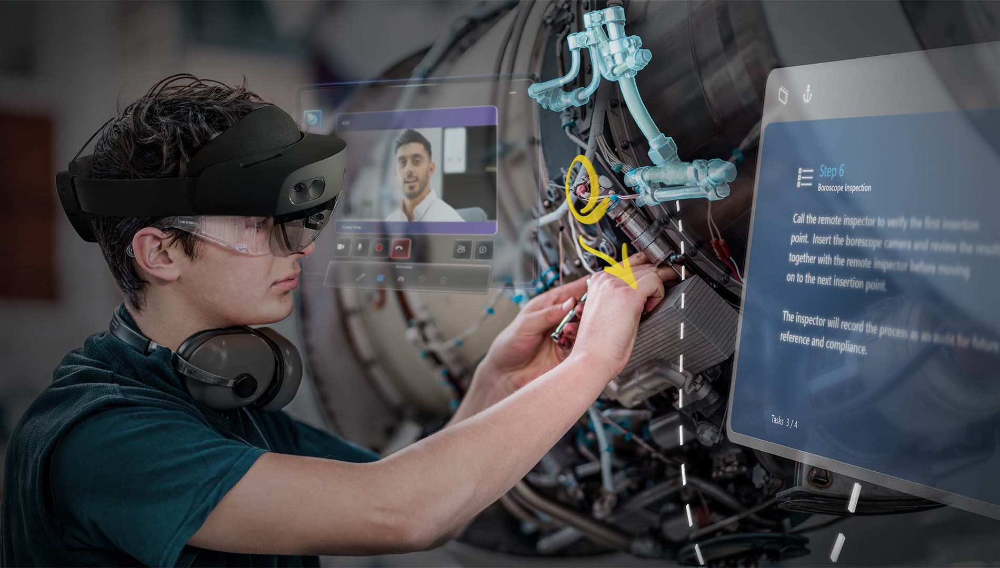
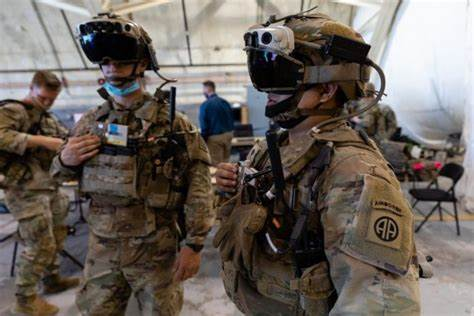

\
\

## **Recent research in the Microsoft Human Factors Lab**

\

 
 {width="400"}  
 

\

**1.) Hololens Long Wear Comfort Research** \
Designed a series of studies where participants wore a variety of Hololens prototypes and performed various activities that resemble front-line worker job duties. Participants were interrupted in regular intervals over the course of the three hour study sessions and asked to respond to a series of questions regarding their comfort, fatigue and perceptions regarding wearing the devices for a whole day shift. We also recorded a series of head scans using a 3DMD high resolution scanning camera array to document how the headsets sit on the head before and after work. This research provided important data that informed design changes in future Hololens devices that will be more balanced and comfortable for folks who may be able to utilize Hololens augmented reality during their workday. \

\

 
 {width="400"}  
 

\

**Military Hololens Research** \
An important application of Hololens Augmented Reality is utilization in helmets of military personnel which may aid in identifying normally difficult to see stimuli and providing recommendation systems that improve efficiency and accuracy. To inform improvements of design we conducted a series of studies recruiting active military personel to don a variety of headset designs and perform a series of navigation tasks in a lab space. We recorded motion capture and EMG data to evaluate efficiency of performing tasks and muscle strain over time. After performing tasks, participants provided qualitative feedback regarding their experience and willingness to adopt the technology in the field. 

\
 
 {width="400"}  
 

\

**2.) Microsoft Surface Haptic Feedback Research**
I work closely with the Microsoft Surface team to design studies that inform re-design and improvement of touchpad haptics. Most recently I designed a series of studies that recorded EMG while interacting with various haptic touchpad models using different waveform conditions to determine a distribution of how individuals respond to various haptic settings. I coupled this with individual differences in sound perception, user interviews and likert scale ratings to determine user thresholds for perceiving touchpad sounds, and preferences for haptic feedback of different haptic prototype devices. 
\

**3.) Mixed Reality Desktops**
Other work at Microsoft involved designing user studies that examined computer desktop working behavior and utilization of larger more spacious environments via mixed reality. This involves examining how fast participants could complete simple navigation, search and selection tasks using different virtual desktop options. Qualitative data was also collected in the form of user interviews probing preferences for desktop arrangements. 

\
\

## **Academic research outside work at Microsoft**
I am currently working on designing a series of experiments that will further examines action and perception feature repetition and hosting these studies on this page using [Pavlovia](https://pavlovia.org/). 
\

The following are a couple of the studies which I am currently working on which will provide further information regarding how and what mechanisms are involved in resolving confusion that occurs when multiple actions are simultaneously activated. 
\
\

1.) **Working Memory Manipulation** - This is an expansion on the topics of my doctoral dissertation. Embedding a Sternberg letter recall task within our partial repetition task. The goal of this is to experimentally manipulate working memory load while also manipulating whether action features repeat or not between planned and intervening actions. 

\

2.) **EEG recording during partial repetition task** -  I originally collected EEG data during our partial repetition task in 2018, however there were some issues with the data and this required recollection which did not end up happening due to the COVID-19 pandemic. If working memory processes are involved in the disentanglement of simultaneously activated action plan then we should easily be able to identify event related components and temporal frequency power changes related to working memory processes during execution of the intervening action in our partial repetition task. Additionally coupling EEG data with pupilometry data may provide important new information regarding how the brain and body recruit resources that allow for the fast adaptation to sudden unexpected environment changes. 

\

3.) **Cooperative behavior and partial repetition costs** - Research in cooperative action and embodied cognition show that observing others behaviors causes automatic mapping of others behavior onto our own action representation system. This embodiment has also beens shown to vary in intensity depending on how much on identifies with the person being observed (i.e., belonging to the same group, sharing attributes...). If observed actions are automatically mapped to our own action system, it is possible that partial repetition costs may be found for an individual completing an intervening action when a co-actor is planning a task that shares action features. 

\

4.) **Sleep deprivation and partial repetition costs** - Sleep deprivation has been show to dramatically impact the ability to make well informed decisions, maintain information in working memory, and respond quickly and appropriately in response to sudden changes. Therefore it is likely that individuals who are sleep deprived will show amplified partial repetition costs but this has yet to be explored. 

\

4.) **Individual differences in partial repetition costs** - our research examining hazard rates of intervening response times when action features are repeated showed some individuals tended to respond very fast and other tended to respond very slow to the intervening response. Interestingly, the fast participants showed complete elimination of partial repetition costs after repeated action training while the slow responders showed only reductions in partial repetition costs after training. 

\

## **New publication examining hazard rates of response times**
As noted in the "In Works" section of the "Publications" tab, I have been working on finalizing a paper demonstrating examination of hazard rates for response times can show how response activation changes over time and how this differs across conditions where action features overlap or do not. Application of hazard rates to examine response activation to day has not happened in the literature yet. Therefore, this paper will argue that examination of hazard rates can show important information that examination of traditional measures of response times (mean, median) cannot show. \
\
I will be posting some of the figures and captions soon to provide a sneak preview of what the paper will show. 

\

## **Eye tracking and pupilometry**
I have been conducting a series of studies at Microsoft using eye tracking and pupilometry to examine what people focus on when interacting with laptops and other digital devices. I am currently working on applying some of these methods to perceptual research related to attentional blindness when action features related to visual stimuli are repeated vs not repeated. 

\

## **Creating new packages in Python and R**
My recent research has revealed that examining hazard rates of response times provides important information regarding how response activation changes over time. This is a relatively novel way of examining response times compared to the traditional methods of measuring central tendency such as mean or median. Its also possible to apply this method of analysis to other aspects of behavior such as EEG and EMG. 

