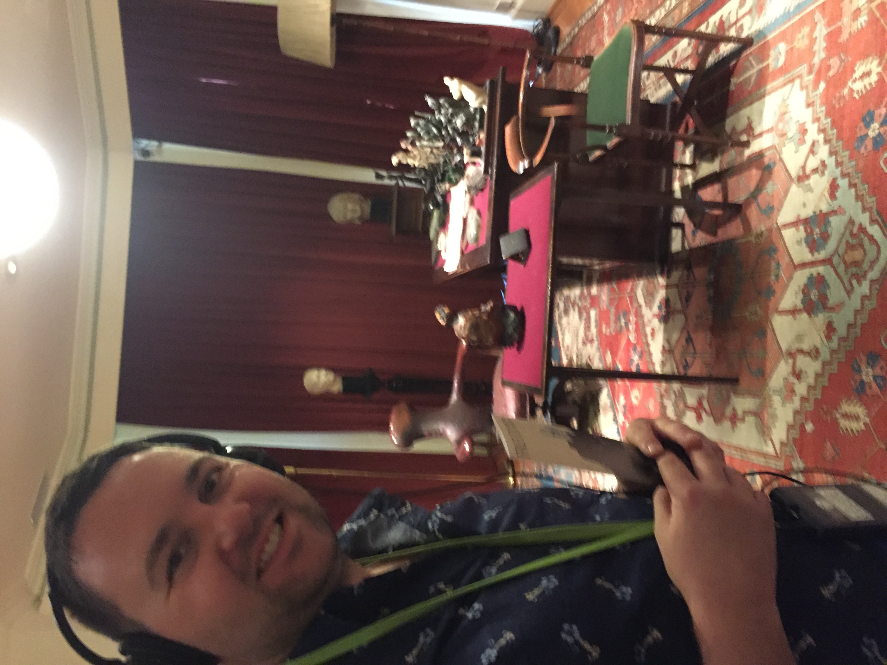
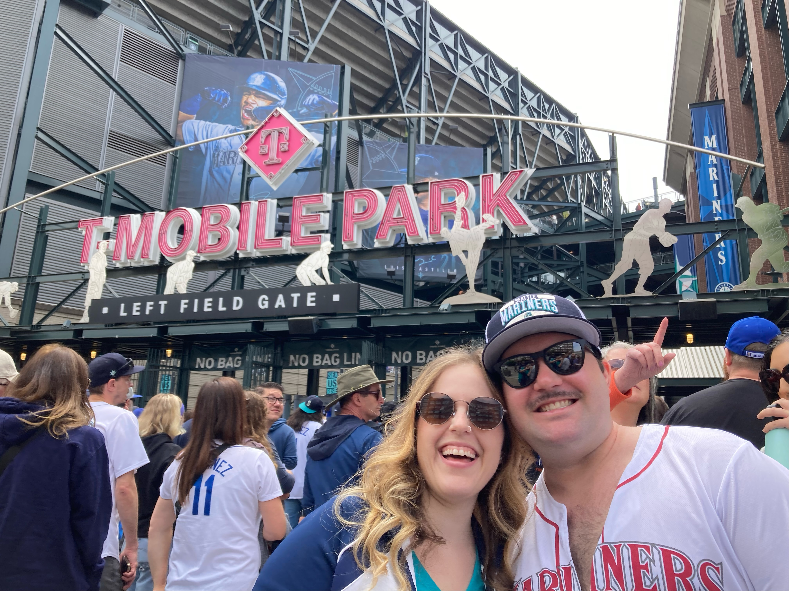
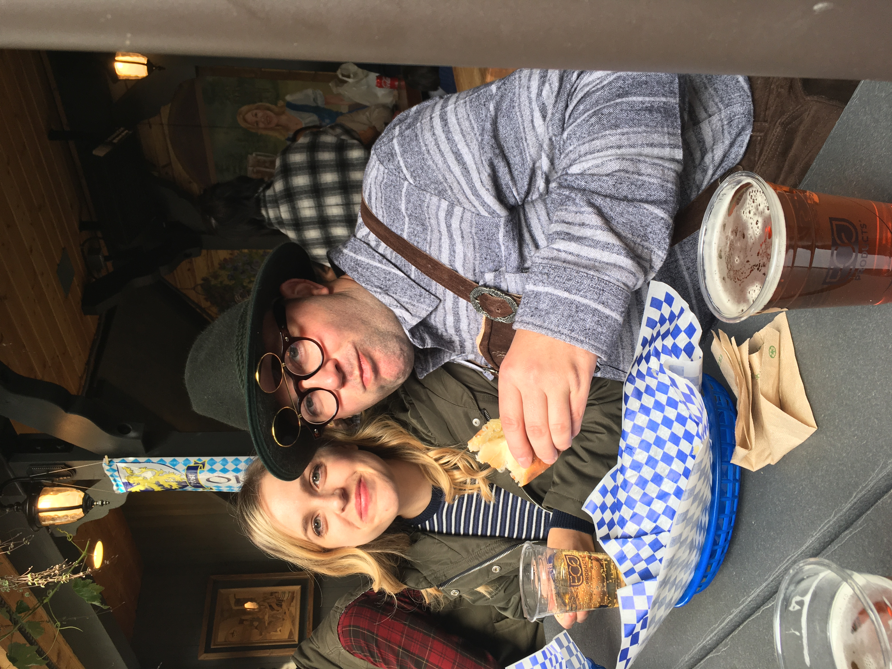
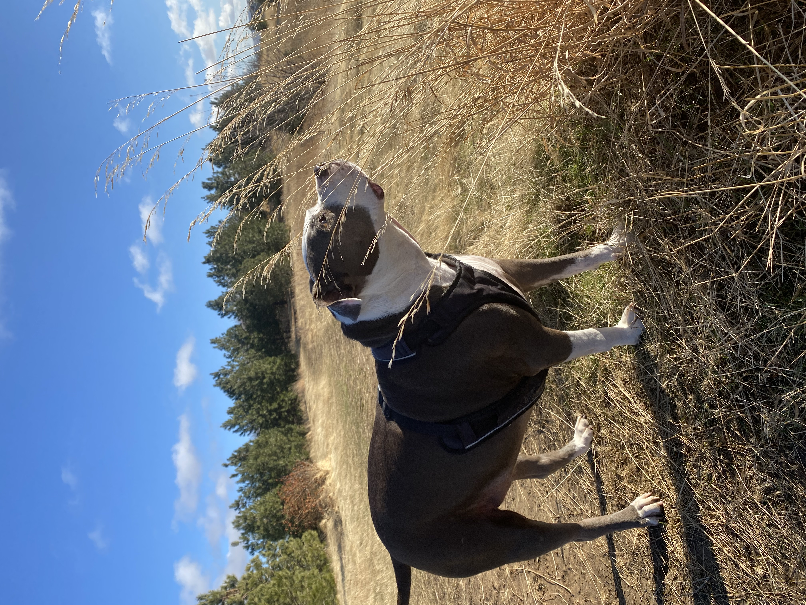
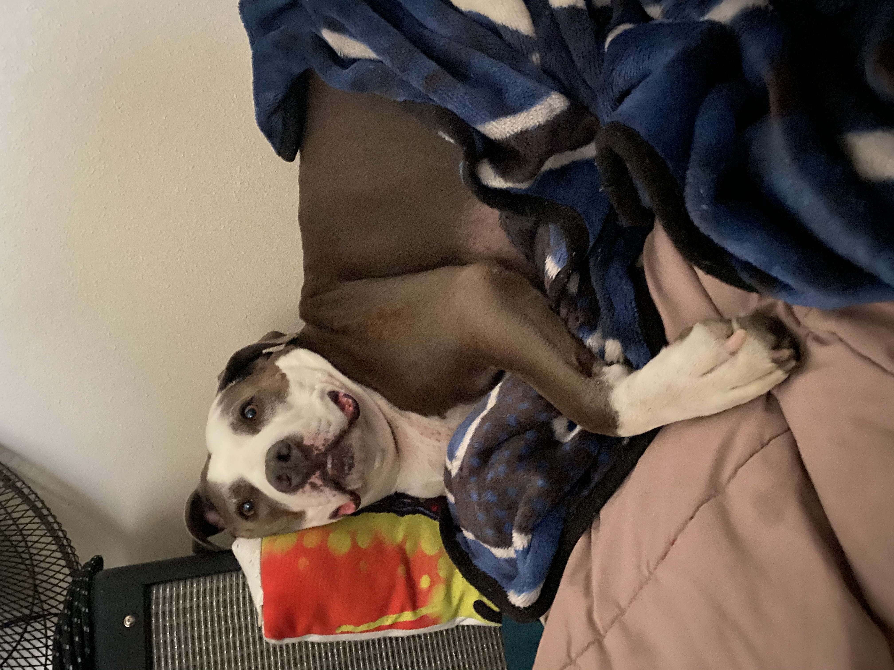
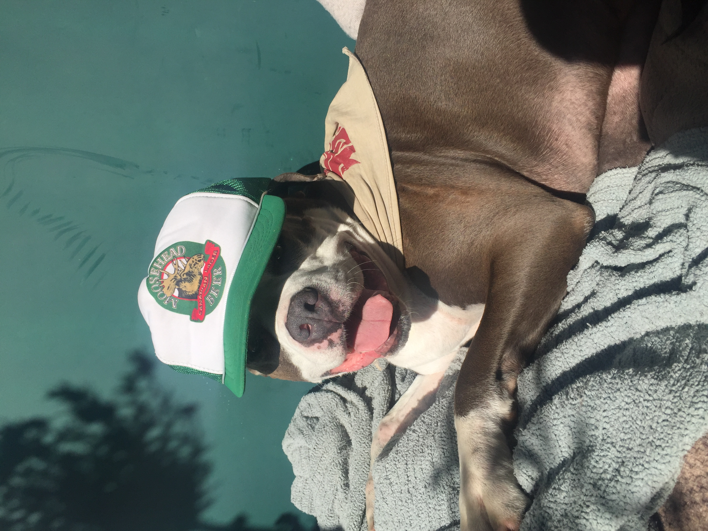

```{=html}
<script>
   $(document).ready(function() {
     $head = $('#header');
     $head.prepend('')
   });
</script>
```
\

### **Experimental Psychologist**

I am an experimental psychologist trained to answer complex research questions with well designed experiments. I have published my research in high impact academic journals such as Attention, Perception and Psychophysics, NeuroImage and The European Journal of Cognition, and presented my research across the United States and Internationally at professional conferences.\
\

### **Academic Research Summary**

My research examines the neural processes involved in the resolution of confusion between multiple simultaneously activated actions and interactions of action and perception. My work has shown that cognitive confusion between simultaneously activated action plans causes delays in response time and response accuracy when planned action features are repeated in intervening actions, and individuals who are more negatively affected by code confusion also more often avoid selecting actions that repeat features. More research is required to determine the specific neural processes that resolve code confusion and continuing this research may illuminate fundamental cognitive processes that allow humans to successfully navigate the environment and make informed decisions. To address these outstanding questions, I design new experiments and test competing theories regarding how action and perception is coordinated, how the brain resolves multiple simultaneously activated information features and how neural processing related to the disentanglement of code confusion may influence free-choice behavior and decision-making.

\

<center>

{width="300"} \<\center\>

### **User Research**

\
I have consistently applied user study research in my academic training and professional experience both designing basic research questions and organizing applied studies that answer specific questions about products or practices that inform design and decision-making.

**Quantitative Research**\
As an experimental psychologist I am focused on identifying and examining quantifiable, objective measurements of human behavior. This entails measuring responses times, response accuracy, decision-making/free-choice behavior, electrophysiology (e.g., EEG, EMG), eye tracking, movement trajectories (motion tracking) etc... I then use a variety of platforms such as python and R to organize the data, run analysis and conduct statistical tests to determine how manipulated variables influence behavior.\

**Qualitative Research**\
My professional research often requires I gather user input on preferences and perceptions while using various devices or completing tasks. Therefore, much of my quantitative data collection efforts are coupled with qualitative research. These methods can include user interviews, surveys, open ended questions etc.. to better understand user experience.

\

<center>{width="300"}\
</center>

### **Data Science**

Experimental psychology requires advanced techniques in data science such as application of machine learning and advances statistical techniques to identify relationships and trends in data. For example, EEG and EMG data often requires independent component analysis and other machine learning methods of classification to identify frequency patterns during trials. Recently I have also been exploring probability distributions for whether responses occur in action planning tasks using logistic regression and neural network models to test competing theories of cognitive control.\
\
Before starting my doctoral research I worked professionally at Central Washington University as a data analyst in the Office of Institutional Effectiveness. Here I applied machine learning models such as random forest, neural networks and logistic regression to identify patterns in university student progression toward completion and retention within programs. Using machine learning we identified important factors that accounted for signitifcant variance in the probability whether a student will be retained through graduation and general academic performance.\
\
\

## **Hobbies and Activities**                  <right>{width="200"} 

</center>

### **Reading!**

I usually try to keep up to date on recent publications in the journal [**Attention, Perception and Psychophysics**](https://link.springer.com/journal/13414) among others.\
\

#### **Some great books I highly recommend if you have not already checked them out.**

**Great Psychology related books**:\
1.) [Higher Cortical Function in Man](https://link.springer.com/book/10.1007/978-1-4615-8579-4) - Aleksandr Romanovich Luria

2.) [Open Minds: The Social Making of Agency and Intentionality](https://www.amazon.com/gp/product/0262017032/ref=ppx_yo_dt_b_search_asin_title?ie=UTF8&psc=1) - Wolfgang Prinz\

and the German version - [Selbst im Spiegel: Die soziale Konstruktion von Subjektivitat](https://www.amazon.com/gp/product/3518297694/ref=ppx_yo_dt_b_search_asin_title?ie=UTF8&psc=1)\

3.) [Response Times: Their Role in Inferring Elementary Mental Organization](https://www.google.com/books/edition/Response_Times/6yvnCwAAQBAJ?hl=en&gbpv=1&dq=luce+response+times+and+decision+making&pg=PR9&printsec=frontcover) - R. Duncan Luce

\

**Great non-psychology related books**:\
1.) [El Ingenioso Hidalgo don Quijote de la Mancha](https://parnaseo.uv.es/lemir/revista/revista19/textos/quijote_1.pdf) - Miguel de Cervantes Saavedra

and [the English version](https://www.gutenberg.org/ebooks/996)

2.) [Dialogue Concerning the Two Chief World Systems](https://www.reed.edu/math/wieting/mathematics537/Dialogue1.pdf) - Galileo Galilei

3.) [Der Behuter](https://www.amazon.com/gp/product/B08BKTJSRC/ref=ppx_yo_dt_b_search_asin_image?ie=UTF8&psc=1) - Catherine Shepard

\

### **Spoken Languages**

I enjoy learning new languages to better understand cognitive and social perspectives of different cultures.\
\
1.) I minored in **Spanish** as an undergrad at Western Washington University and am casually conversational.\
\
2.) I have been studying **German** and **Dutch** since I started my Ph.D. research in 2017 and like to think I am conversational, aber in realität brauche ich noch viel Übung.\
\
3.) A large portion of my wife's family is **Italian** and therefore I will be working on learning Italian as well as French sometime in the future.\
\
4.) I also would like to pick up some dialects of **Mandarin**, **Vietnamese** and **Russian** at some point.\
\
I really enjoy reading books, particularly mystery books languages other than English because it really helps me learn how conversations are held, it helps me learn vocabulary quickly and slowly learning the language as you unravel a mystery really makes the plot a true mystery!\
\
\

### **Music**

I have been playing music via various instruments most of my life. I enjoy playing along with all kinds of different genres of music and artists as well as creating my own music when I have time. I enjoy messing around, writing music and playing with friends. I play a variety of instruments including trumpet, guitar, keys and anything else I can get my hands on.

<!-- Add pic of guitar here -->

\

<center>{width="400"} 

</center>

\
\

<center>

#### **Some pictures showing I do in fact get out of the house and have fun.**

</center>

\

<center>

{width="400"}

\

{width="500"}

\

{width="400"}

</center>

\

<center>

**A couple pictures of our pup Barkley. She is a real great gal.**

{width="400"}

\

{width="400"}

\

{width="400"}

</center>
